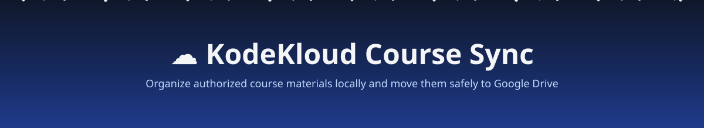
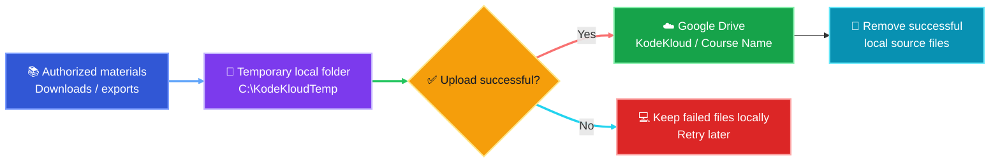

<div align="center">



[](https://www.python.org/)
[](https://rclone.org/)
[](https://www.microsoft.com/windows)
[](#-responsible-use)

<br />

```text
┌────────────────────┐
│  Authorized Files  │
│  PDFs • Labs • ZIP │
│  Official Exports  │
└─────────┬──────────┘
          │
          ▼
┌────────────────────┐
│ Temporary Folder   │
│ C:\KodeKloudTemp   │
└─────────┬──────────┘
          │ rclone move
          ▼
┌────────────────────┐
│    Google Drive    │
│  KodeKloud/<course>│
└────────────────────┘
```

</div>

---

## ✨ What this does

KodeKloud Course Sync helps you keep permitted study materials organized without permanently filling your computer’s storage.

| Feature | Description |
|---|---|
| 📁 Clean organization | Keeps each course in its own folder |
| ☁️ Google Drive sync | Uploads files to your personal Drive |
| 🧹 Automatic cleanup | Removes local files only after successful upload |
| 🔁 Retry friendly | Failed transfers remain on your PC for a later retry |
| 🔐 Private by design | No browser cookies, session tokens, or credentials are committed to Git |

> [!IMPORTANT]
> This project is intended only for files you are authorized to download or export, including course attachments, PDFs, lab files, code repositories, notes, and official offline downloads.

---

## 🧭 Workflow animation



<div align="center">

```text
📥 Download  ━━━━━━━▶  📂 Organize  ━━━━━━━▶  ☁️ Upload  ━━━━━━━▶  🧹 Clean up
```

</div>

### Transfer lifecycle

```text
[ 1. Download authorized files ]
               ↓
[ 2. Place them in a course folder ]
               ↓
[ 3. Preview transfer with --dry-run ]
               ↓
[ 4. Upload to Google Drive ]
               ↓
[ 5. Remove local files after upload ]
```

---

## ✅ Requirements

Before you begin, make sure you have:

- A KodeKloud account and permission to download the materials you plan to store
- A Google Drive account
- Windows 10 or Windows 11
- [Rclone](https://rclone.org/downloads/) installed and connected to Google Drive

<details>
<summary><strong>Recommended local folder layout</strong></summary>

Create a temporary workspace:

```text
C:\
└── KodeKloudTemp\
    └── Crash-Course-Kubernetes\
        ├── resources\
        │   ├── kubernetes-cheatsheet.pdf
        │   └── slides.pdf
        ├── labs\
        │   └── lab-files.zip
        └── notes\
            └── personal-notes.md
```

</details>

---

## ⚙️ Set up Rclone

### 1. Install Rclone

Open Command Prompt and run:

```cmd
winget install Rclone.Rclone
```

Close and reopen the terminal, then check the installation:

```cmd
rclone version
```

### 2. Connect your Google Drive

Start setup:

```cmd
rclone config
```

Use these recommended choices:

| Prompt | Choice |
|---|---|
| New remote | `n` |
| Name | `gdrive` |
| Storage type | `Google Drive` |
| Client ID | Press Enter |
| Client secret | Press Enter |
| Access scope | Full Drive read/write |
| Root folder ID | Press Enter |
| Service account | Press Enter |
| Advanced config | `n` |
| Auto config | `y` |
| Shared Drive | `n` unless you use one |
| Confirm configuration | `y` |
| Exit | `q` |

A browser window will open. Sign in to the Google account that should receive your files and approve Rclone access.

### 3. Test the connection

```cmd
rclone lsd gdrive:
```

If it lists Drive folders or returns without an error, you are ready.

---

## 🚀 Upload a course folder

### Create a course workspace

```cmd
mkdir C:\KodeKloudTemp
mkdir C:\KodeKloudTemp\Crash-Course-Kubernetes
```

Place your authorized downloads in:

```text
C:\KodeKloudTemp\Crash-Course-Kubernetes
```

### Preview before changing anything

This command makes **no changes**:

```cmd
rclone move "C:\KodeKloudTemp\Crash-Course-Kubernetes" "gdrive:KodeKloud/Crash-Course-Kubernetes" --dry-run --progress
```

### Upload and clean up

When the dry run looks correct:

```cmd
rclone move "C:\KodeKloudTemp\Crash-Course-Kubernetes" "gdrive:KodeKloud/Crash-Course-Kubernetes" --progress --transfers 4 --checkers 8 --delete-empty-src-dirs
```

> [!TIP]
> `rclone move` is intentionally used instead of `rclone sync`. It uploads files first, then removes each local file only after a successful upload. It does not mirror-delete unrelated files already in Google Drive.

---

## 🖱️ One-click Windows script

Create a file named:

```text
Upload-KodeKloud-to-Drive.cmd
```

Paste in the following content:

```bat
@echo off
setlocal EnableExtensions

title KodeKloud Authorized Materials - Google Drive Sync

set "SOURCE=C:\KodeKloudTemp\Crash-Course-Kubernetes"
set "DESTINATION=gdrive:KodeKloud/Crash-Course-Kubernetes"

echo.
echo ===============================================
echo   KodeKloud Materials -^> Google Drive
echo ===============================================
echo.
echo Source:      %SOURCE%
echo Destination: %DESTINATION%
echo.

if not exist "%SOURCE%" (
    echo [ERROR] The source folder was not found.
    echo %SOURCE%
    echo.
    pause
    exit /b 1
)

echo Starting upload...
echo.

rclone move "%SOURCE%" "%DESTINATION%" ^
  --progress ^
  --transfers 4 ^
  --checkers 8 ^
  --delete-empty-src-dirs

if errorlevel 1 (
    echo.
    echo ===============================================
    echo [WARNING] Upload did not complete successfully.
    echo Failed files remain in the source folder.
    echo Run this script again after fixing the issue.
    echo ===============================================
    echo.
    pause
    exit /b 1
)

echo.
echo ===============================================
echo [SUCCESS] Upload completed.
echo Successfully transferred local files were removed.
echo ===============================================
echo.
pause
```

Update these two lines for every new course:

```bat
set "SOURCE=C:\KodeKloudTemp\YOUR-COURSE-NAME"
set "DESTINATION=gdrive:KodeKloud/YOUR-COURSE-NAME"
```

Then double-click the `.cmd` file.

---

## 🔒 Keep secrets private

Never commit these files to GitHub:

```gitignore
# Credentials and local settings
rclone.conf
*.token
*.session
cookies*.txt
browser-profile/

# Local downloaded content
CourseDownload/
KodeKloudTemp/
```

Never post session cookies, Bearer tokens, Google OAuth credentials, browser profile data, or Rclone configuration files in issues, commits, README files, or screenshots.

---

## 🛟 Troubleshooting

<details>
<summary><strong><code>rclone</code> is not recognized</strong></summary>

Close and reopen Command Prompt after installation. Then run:

```cmd
rclone version
```

If the command still fails, install Rclone manually from [rclone.org/downloads](https://rclone.org/downloads/).

</details>

<details>
<summary><strong>Google Drive authorization fails</strong></summary>

Run:

```cmd
rclone config
```

Delete or reconfigure the `gdrive` remote, then repeat browser authorization.

</details>

<details>
<summary><strong>Some files stayed in the local folder</strong></summary>

That is expected when a transfer fails. The files remain locally so they are not lost.

Check the error output, resolve the network or quota issue, and run the same command again.

</details>

<details>
<summary><strong>How do I confirm Drive contains my files?</strong></summary>

Run:

```cmd
rclone lsf "gdrive:KodeKloud/Crash-Course-Kubernetes" -R
```

Or open Google Drive in your browser and look inside:

```text
My Drive / KodeKloud / Crash-Course-Kubernetes
```

</details>

---

## ⚖️ Responsible use

This project is for organizing and syncing materials you are personally authorized to download, export, or store.

- Respect KodeKloud’s Terms of Service and copyright conditions
- Do not share, redistribute, or resell course videos or materials
- Do not store browser cookies, session tokens, Bearer credentials, or OAuth files in Git repositories
- Use official KodeKloud download/export options where available

---

<div align="center">

### Built for organized learning ☁️📚

</div>
